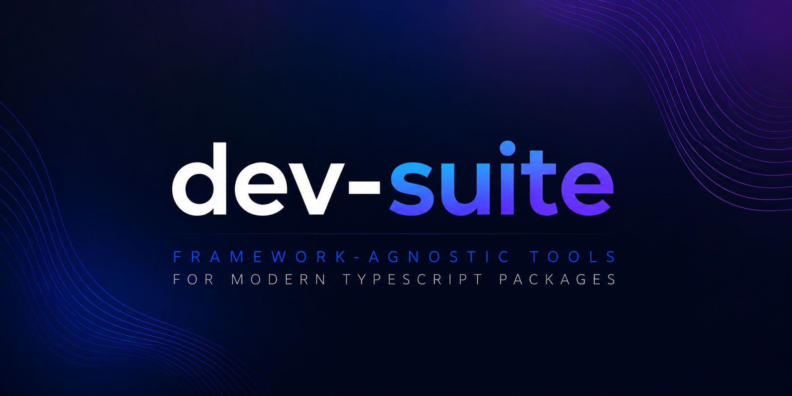

# dev-suite

<p align="center">
  
</p>

<p align="left">
  <a href="https://www.npmjs.com/package/%40dev-suite%2Fdecorators"></a>
</p>

Framework-agnostic TypeScript utility monorepo.

Current package:

- [`@dev-suite/decorators`](https://www.npmjs.com/package/%40dev-suite%2Fdecorators) - reusable class, method, property, and parameter decorators.

## Why dev-suite

- Framework-agnostic: no dependency on Nest/Express/React.
- Production-oriented primitives: retry, timeout, cache, dedupe.
- Strong TypeScript support with generated declaration files.
- Root exports + subpath exports.

## Repository Structure

```text
.
├── packages/
│   └── decorators/      # package source, tests, build scripts
├── test/
│   └── decorators/      # integration tests for package exports/subpath imports
└── .github/             # issue and PR templates
```

## Quick Start

```bash
yarn install
yarn build:decorators
yarn test:decorators
yarn test:decorators:imports
```

## Scripts

- `yarn lint` - lint pipeline for decorators workspace.
- `yarn build:decorators` - build `@dev-suite/decorators`.
- `yarn test:decorators` - run decorators unit tests.
- `yarn test:decorators:imports` - verify root and subpath exports.

## Contributing

1. Create a branch.
2. Make focused changes.
3. Keep **100% test coverage** for touched code paths.
4. Run relevant tests and lint.
5. Open a PR using the project template.

Issue and PR templates:

- [Bug report](./.github/ISSUE_TEMPLATE/bug_report.md)
- [Feature request](./.github/ISSUE_TEMPLATE/feature_request.md)
- [Pull request template](./.github/pull_request_template.md)

Wiki:

- [Decorators Matrix](https://github.com/awekrx/dev-suite/wiki/Decorators-Matrix)

## License

MIT
